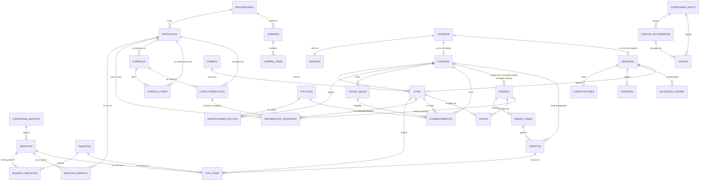

# Ópalo · cómo guarda la información el sistema

> Para los socios. Explica, sin tecnicismos, qué información guarda el sistema de Ópalo,
> cómo se relaciona y qué preguntas del negocio responde. El detalle técnico está en
> [`ESPEC.md`](ESPEC.md) y en [`../supabase/README.md`](../supabase/README.md).

## La idea en una frase

Todo lo que pasa en Ópalo deja un registro: **quién vino, qué se hizo, qué se usó, qué se
fabricó en el taller, cuánto se cobró y cuánto se gastó**. Con esos registros el sistema responde solo preguntas como
"¿cuánto ganamos este mes?" o "¿qué hay que reponer?", sin hojas de cálculo aparte.

## Los módulos

### 1. Catálogo — lo que ofrecemos
- **Categorías**: depilación con cera, faciales, corporales y complementos.
- **Servicios** (29): cada uno con su precio. Si el precio aún no está definido, se guarda
  **vacío** y el sitio dice "precio por confirmar": se puede reservar (se cobra en cabina),
  pero no se vende en línea.
- **Complementos** (shot hidratante, ampolletas, azuleno): sólo se reservan junto con un servicio.
- **Paquetes** (4): *combo* = varios servicios en una visita (Express, Media, Rostro, Total);
  *bono* = varias sesiones del mismo servicio para usar en distintas visitas (por eso un bono lleva
  un solo servicio). Desde el panel, el paquete y sus servicios se guardan **juntos y de una vez**
  (función `guardar_paquete`): si algo no es válido no se guarda nada, así nunca queda un paquete a
  medias. Un paquete no se borra: se desactiva.
- **Contraindicaciones** (13): las preguntas de la ficha de salud ("¿estás embarazada?",
  "¿tomas isotretinoína?"…). Cada una dice a qué categorías aplica y qué hacer si la respuesta
  es sí (revisar antes de confirmar, o sólo tener precaución).

La fuente de todo esto es el archivo `datos/catalogo.json`; de ahí se carga la base.

### 2. Clientas y equipo
- **Clientas**: nombre, teléfono, correo, fecha de nacimiento y si acepta promociones. Pueden
  tener cuenta en el sitio o no (las que agendan por WhatsApp las da de alta el personal).
  Si una clienta registrada por el personal después crea su cuenta con el mismo correo, el
  sistema la reconoce y no la duplica, pero **sólo cuando confirma su correo** (así nadie entra
  al historial de otra registrándose con su correo). Si se borra una cuenta, su ficha se
  conserva sin el correo. Las **notas internas** sólo las ve el equipo: la base no se las
  entrega a la clienta aunque las pida directamente.
- **Fecha de nacimiento**: se pide para reservar en línea (decide la edad mínima y si una menor
  necesita tutor). La clienta la captura una vez; si hay un error, la corrige el equipo.
- **Equipo**: quién atiende, su horario semanal y los servicios que hace.
- **Capacitaciones**: cursos, talleres, diplomados y certificaciones de cada persona. Son la
  prueba de "en capacitación constante" y se muestran en el sitio (sólo nombre, institución,
  tipo, fecha y horas; las notas y las constancias, que pueden traer la CURP, son internas).
- **Roles**: *clienta*, *personal* (cabina) y *admin* (socios). Cada quien ve sólo lo que le toca.
  Por ahora los roles (y ligar a alguien del equipo con su cuenta) se cambian desde el editor SQL
  de Supabase; el panel todavía no tiene esa pantalla.

### 3. Agenda
- **Cabinas**: hoy hay una. Una cita necesita persona **y** cabina libres.
- **Horarios**: martes a viernes de 10:00 a 19:00 y sábado de 9:00 a 15:00. Los socios los editan en
  el panel; el horario semanal de cada persona se guarda completo de una vez (función
  `guardar_horarios`), con varios rangos por día si hace falta (p. ej. para comer), pero sin que se
  encimen y con la salida después de la entrada.
- **Fecha de apertura**: el sistema sabe que Ópalo abre el **31 de octubre de 2026**. Antes de ese
  día las clientas no ven horarios ni pueden reservar en el sitio; el equipo sí puede agendar (por
  ejemplo, el ensayo de apertura). Desde el día de la apertura todo funciona normal. Para moverla,
  en el editor SQL de Supabase:
  `update public.configuracion set fecha_apertura = '2026-11-07';` (o `= null` para quitar la
  restricción), y la misma fecha en `datos/catalogo.json`, para que no regrese la anterior al volver
  a cargar el catálogo.
- **Bloqueos**: días u horas cerradas (festivos, capacitación, comida). Pueden ser de una persona
  o de todo el spa.
- **Citas**: sesiones de **1 hora**, con fecha, hora, quién atiende, cabina, estado
  (pendiente, confirmada, en curso, completada, cancelada, no asistió), de dónde vino
  (sitio, WhatsApp, mostrador, teléfono), total y si es la primera vez de la clienta.
  **La base no permite dos citas encimadas** de la misma persona o en la misma cabina, aunque
  dos clientas reserven al mismo segundo. El personal tampoco puede agendar sobre un bloqueo
  (vacaciones, festivo); si no elige quién atiende, el sistema asigna a quien está libre.
- **Para que nadie acapare la agenda**, cada clienta puede tener en línea hasta **3 citas
  próximas**; para más, el equipo se las agenda por WhatsApp.

### 4. Políticas, ficha de salud y consentimiento
- **Políticas**: términos, aviso de privacidad, cancelación y los tres consentimientos
  (depilación, facial, corporal). Cada cambio crea una **versión nueva**; la anterior se guarda
  tal cual. A cada versión se le calcula una "huella digital" (hash) que demuestra que el texto
  no se alteró.
- **Aceptaciones**: qué versión aceptó cada clienta y cuándo. Cuando una política cambia, la
  clienta la acepta de nuevo en su siguiente reserva.
- **Ficha de salud**: las respuestas a las contraindicaciones, alergias y medicamentos. Son
  **datos sensibles** (ley de protección de datos): sólo los ven la clienta y el equipo, y para
  guardarlos se pide su consentimiento expreso. Se guarda el historial; la última es la vigente.
- **Consentimientos firmados**: la firma en pantalla, el nombre de quien firma (y del tutor si es
  menor), la versión exacta del documento, la ficha de salud de ese momento, la fecha, **quién la
  capturó y dónde** (en la tablet de la cabina, al reservar o desde la cuenta de la clienta) y una
  huella digital que cubre todo eso, incluida la firma. **No se pueden editar ni borrar.**
  **Sin consentimiento firmado no se puede iniciar ni completar un servicio**; por eso cada
  servicio que se puede agendar debe decir qué consentimiento se firma.
- **La firma se hace en el spa** (decisión del 8 de octubre de 2026): el consentimiento **no se
  pide ni se menciona a las clientas en línea**. La clienta reserva sin firmar y la cita aparece en
  la agenda con **"Falta firma"**; el día de su cita firma en la **tablet de la cabina**, antes del
  servicio (el equipo abre "Firmar en cabina"). Si intentara firmar desde su cuenta, el sistema le
  responde "La firma se hace en el spa, el día de tu cita." Después, en su cuenta → Documentos, ve
  la copia de lo que firmó. Es un interruptor de la configuración (`firma_en_linea`): si algún día
  se quiere volver a firmar al reservar en línea, se cambia a "sí" y todo regresa como antes.

### 5. Ventas y pagos
- **Pedidos** de la tienda en línea (folio OP-00001…): servicios, paquetes o productos, también
  para regalar. Hoy no hay pasarela de pago: se paga en el spa o por transferencia y el personal
  lo registra.
- **Pagos**: de un pedido o de una cita, con su método (efectivo, tarjeta, transferencia,
  Mercado Pago, cortesía). La **propina se guarda aparte** (es de quien atiende, no del spa).
  En la tienda la clienta sólo elige efectivo, tarjeta o transferencia (la cortesía la decide el
  equipo al cobrar) y puede tener hasta 5 pedidos por pagar.
- **Venta en mostrador**: en el spa el equipo vende ahí mismo jabones, velas, sets, servicios
  prepagados o paquetes. La venta queda como un pedido "de mostrador" con su folio, ya **pagado**
  (también como cortesía) y, si lleva productos, ya **entregado**. Si sólo son productos no hace
  falta registrar a la clienta (en la lista sale como "Venta de mostrador"); los servicios
  prepagados sí piden clienta, porque se vuelven sus créditos. No deja vender más piezas de las que
  hay.
- **Entregas**: lo que se compra en la tienda en línea **se recoge en Ópalo** (el envío a domicilio
  queda para después). Un pedido pagado con productos queda "por entregar" hasta que el equipo lo
  marca como entregado; el resumen del día dice cuántos hay. La tienda en línea tampoco deja pedir
  más piezas de las que hay ("Por ahora sólo quedan 3 piezas de…", "Por ahora no tenemos…").
  Un pedido en línea **no aparta** las piezas: se aseguran cuando se registra el pago. Si mientras
  tanto se vendieron en el mostrador, el sistema no deja cobrar lo que ya no hay (el inventario nunca
  queda en negativo) y el equipo ajusta o cancela el pedido con la clienta.
- **Créditos (servicios prepagados)**: al pagarse un pedido, cada servicio o paquete comprado se
  vuelve un crédito que la clienta usa al reservar (la cita queda en $0). Vencen en 365 días
  (o lo que diga el paquete) y deben estar vigentes **el día de la cita**. Si se compró **para
  regalar**, el regalo trae un **código de 8 letras** que la persona regalada canjea en su cuenta
  (un bono de varios servicios es un solo código y se canjea completo). Si se cancela la cita, el
  crédito regresa; si la clienta no asistió, no.

### 6. Inventario y costos
- **Productos**: insumos de cabina (cera, talco, aceite, guantes…), **materia prima y envases del
  taller** (aceites, manteca, sosa, cera de soya, mechas, frascos, etiquetas…) y productos de venta,
  incluidos los **jabones, velas y sets hechos en Ópalo**. Cada uno con su presentación ("Lata
  800 g"), su costo y el **stock en gramos, mililitros o piezas**. Los jabones, velas y sets se
  cuentan **por pieza** (así su costo es el de una pieza).
- **Ficha de la tienda**: lo que se vende en línea lleva su ficha pública: descripción, aroma,
  ingredientes (como en la etiqueta), modo de uso, advertencias (las velas, las de seguridad),
  contenido neto ("100 g"), foto o color para la ilustración, si es destacado y si está hecho en
  Ópalo. El sitio sólo ve esa ficha, el precio, cuántas piezas hay y, si está agotado, **cuándo
  estará listo el próximo lote**; nunca costos, proveedores ni notas.
- **Recetas**: cuánto se usa de cada producto en cada servicio (ej. cejas: 10 g de cera, 2 guantes).
  El equipo guarda la receta completa de un servicio de una vez (función `guardar_receta`).
- **Compras**: al registrar una compra sube el stock y se actualiza el costo con el último precio.
- **Movimientos**: cada entrada y salida queda registrada (compra, consumo en cabina, venta,
  ajuste, merma). El stock nunca se "teclea": siempre sale de los movimientos. Al **completar una
  cita**, el sistema descuenta solo los insumos de la receta (una sola vez).
- **Stock mínimo**: cuando un producto llega a su mínimo aparece en "por reponer", con cuántas
  presentaciones comprar: las suficientes para quedar **por encima** del mínimo (si se compra lo
  sugerido, el producto sale de la lista).

### 6.1 Taller: jabones y velas hechos en Ópalo
- **Fórmulas** (recetas del taller): qué materia prima lleva un lote completo, cuántas piezas
  rinde y cuántos días de **curado** necesita (jabón en frío: 4 a 6 semanas; velas: de 0 a 2
  semanas). Con los costos actuales de la materia prima el sistema calcula cuánto cuesta un lote,
  cuánto cuesta cada pieza y cuánto deja cada pieza al precio de venta.
- **Lotes**: cada vez que se hace una tanda se registra un lote con su código (`JAB-261008-01`:
  jabón, fecha de elaboración y número del día; `VEL-…` velas, `SET-…` sets). Al registrarlo,
  la materia prima **sale del inventario con su costo** (la de la fórmula ajustada a las piezas
  que se van a hacer, o lo que realmente se usó si fue distinto). Si no alcanza algo, el sistema lo
  dice antes de mover nada ("No alcanza el inventario de aceite de oliva: hay 300 ml y se
  necesitan 450 ml.").
- **Curado**: el lote queda **"en curado"** hasta su fecha de listo; mientras tanto esas piezas
  no se pueden vender, y la tienda muestra cuándo estarán listas. Cuando termina, el equipo lo
  **libera** anotando cuántas piezas salieron de verdad: entran al inventario y su **costo real por
  pieza** (costo del lote entre piezas obtenidas) pasa a ser el costo del producto. Liberar antes de
  tiempo se puede, pero hay que confirmarlo. Un lote que no necesita curado se libera al registrarlo.
  Un **jabón** siempre se registra con su fórmula (de ahí salen sus días de curado): sin ella
  quedaría a la venta el mismo día, sin curar.
- **Descartar**: si un lote sale mal se descarta con su motivo; no entra al inventario y lo que
  costó cuenta como **merma** del mes.

### 7. Gastos
- **Categorías**: renta, mantenimiento del edificio, luz, agua, internet, teléfono, sistemas,
  pagos al personal, comisiones, capacitación, publicidad, limpieza, reparaciones, impuestos, otros.
- **Gastos fijos (recurrentes)**: renta, luz, agua, internet… con su día de pago y su próximo
  vencimiento. Al registrar el pago, el vencimiento avanza solo al siguiente periodo.
- **Gastos**: cada pago real, con el mes al que corresponde. Sólo los socios los ven.

### 8. Resultados
Se calculan solos a partir de todo lo anterior (ver la tabla de abajo).

## Cómo se relaciona todo

## Qué pregunta responde cada vista

| Pregunta del negocio | Dónde se ve | Quién la ve |
|---|---|---|
| ¿Cuánto ganamos este mes? ¿Y los meses anteriores? | **Resultados del mes** (`v_resultado_mensual`): ingresos, propinas, costo de insumos, **costo de lo vendido**, **mermas**, compras, gastos, **utilidad** y **flujo** de los últimos 12 meses con actividad, hasta el mes en curso | Socios |
| ¿Qué hay que reponer? ¿Cuánto nos costará? | **Por reponer** (`v_reposicion`): productos en o bajo su mínimo, cuánto falta, cuántas presentaciones comprar (para quedar por encima del mínimo), costo estimado y proveedor | Equipo y socios |
| ¿Cuánto nos cuesta cada servicio y cuánto nos deja? | **Costo por servicio** (`v_costo_servicio`): costo de material según la receta, margen en pesos y en % | Equipo y socios |
| ¿Qué gastos fijos vencen pronto? | **Gastos por vencer** (`v_gastos_por_vencer`): vencido / próximo (7 días o menos) / al corriente | Socios |
| ¿Qué citas hay hoy, con quién, ya firmó, ya pagó? | **Agenda** (`v_citas_detalle`): clienta, hora, duración, quién atiende, cabina, estado, alertas de la ficha, consentimientos firmados, pagado | Equipo (todas) · cada clienta (las suyas) |
| ¿Quiénes son nuestras clientas y qué tan seguido vienen? | **Clientas** (`v_clientes_resumen`): visitas completadas, última visita, próxima cita, total pagado y si la cuenta es del equipo (para separarla de las clientas) | Equipo y socios |
| ¿Qué pedidos faltan por cobrar? ¿Y por entregar? | **Pedidos** (`v_pedidos_detalle`): folio, estado, total, lo pagado, lo comprado, si fue en línea o en mostrador, si lleva productos y si ya se entregó | Equipo · cada clienta (los suyos) |
| ¿Qué hay en la tienda? ¿Cuándo vuelve lo agotado? | **Tienda** (`productos_tienda`): ficha pública, precio, piezas disponibles y fecha del próximo lote en curado | Todos (también el sitio público) |
| ¿Qué lotes están curando y cuáles ya se pueden liberar? | **Lotes** (`v_lotes`): código, producto, fórmula, elaboración, fecha de listo y días que faltan, piezas, costo y estado | Equipo y socios |
| ¿Cuánto nos cuesta hacer cada jabón o vela y cuánto nos deja? | **Costo de fórmulas** (`v_costo_formulas`): costo del lote y por pieza con los precios actuales de la materia prima, margen por pieza | Equipo y socios |
| ¿Qué productos dejan más? ¿Qué se vende? | **Margen por producto** (`v_margen_productos`): precio, costo por pieza, margen, existencias, piezas en curado y vendidas en 30 días | Equipo y socios |
| ¿Qué servicios prepagados tiene cada clienta? | **Créditos** (`v_creditos`): cuántos le quedan, hasta cuándo, códigos de regalo | Equipo · cada clienta (los suyos) |
| ¿Qué horarios puedo ofrecer? | **Horarios disponibles** (función `horarios_disponibles`): sólo horas con persona y cabina libres, con 2 horas de anticipación y hasta 60 días adelante; antes de la apertura, sólo para el equipo | Todos (también el sitio público) |

Cómo se calculan los resultados del mes:

- **Ingresos** = lo cobrado (pagos), **sin propinas** y **sin cortesías**.
- **Costo de insumos** = lo que se gastó de producto en las cabinas (consumo de las recetas ×
  su costo).
- **Costo de lo vendido** = lo que costaban los productos que se vendieron (jabones, velas,
  cremas…), también los regalados como cortesía (la cortesía no es ingreso, pero el jabón sí costó).
- **Mermas** = lo que se rompió, caducó o se tiró del inventario, más lo que costaron los lotes
  del taller que se descartaron ese mes.
- **Utilidad** = ingresos − costo de insumos − costo de lo vendido − mermas − gastos.
  *¿El negocio es rentable?*
- **Flujo** = ingresos − compras − gastos. *¿Entró más dinero del que salió?* (las compras de
  inventario, también la materia prima del taller, salen de la caja aunque se usen después).
- La materia prima de un lote **no** se cuenta como gasto el día que se usa: se vuelve el costo de
  las piezas y cuenta cuando se venden (costo de lo vendido) o, si el lote se descarta, como merma.
- Los meses se cuentan en **hora de Querétaro**.

## El día a día

1. **Una clienta reserva en el sitio**: elige servicios → día → hora (sólo ve horarios libres) →
   inicia sesión → llena su ficha de salud → acepta las políticas → la cita queda
   **confirmada** (sin firma: aparece como "Falta firma"). Si en la ficha marcó algo que hay que
   revisar (embarazo, isotretinoína, diabetes…), queda **pendiente** con la alerta visible para
   el equipo, que la confirma por WhatsApp.
2. **Alguien escribe por WhatsApp**: el personal la da de alta (si es nueva) y le agenda la cita
   desde el panel. También nace "Falta firma".
3. **En cabina**: la clienta firma el consentimiento en la tablet ("Firmar en cabina"), el personal
   marca la cita "en curso" (sólo si hay firma), al terminar la marca "completada" (el inventario
   se descuenta solo) y registra el pago y la propina.
4. **Cancelaciones**: la clienta puede cancelar desde su cuenta hasta 24 horas antes; después,
   por WhatsApp. El personal puede cancelar siempre. Si la cita usaba un servicio prepagado,
   el crédito regresa.
5. **Tienda**: la clienta compra (también para regalar), paga en el spa o por transferencia, el
   personal registra el pago y la clienta recibe sus créditos (o el código de regalo). Si compró
   jabones o velas, los recoge en Ópalo y el equipo marca el pedido como entregado.
6. **Mostrador**: alguien compra una vela en recepción: el equipo registra la venta (cobro,
   salida del inventario y entrega, todo de una vez).
7. **Taller**: se hace una tanda de jabón → se registra el lote (la materia prima se descuenta
   sola) → queda en curado → cuando cumple su fecha aparece en el resumen del día como "listo para
   liberar" → se libera con las piezas que salieron y ya se puede vender.
8. **Llega mercancía**: el personal registra la compra (sube el stock y se actualiza el costo).
   Si algo se rompe o se tira, se registra como merma.
9. **Pagos del local**: los socios registran cada gasto; los fijos avanzan solos a su siguiente
   vencimiento.
10. **Fin de mes**: los socios abren "Resultados" y ven ingresos, gastos, utilidad y flujo.

## Lo que todavía falta definir (con la especialista y los socios)

- **Precios por confirmar** de 12 servicios (bigote, patillas, brazos, limpieza facial,
  reductivo…). Mientras tanto se reservan pero no se venden en línea.
- **Duraciones**: hoy todo cabe en la sesión de 1 hora. Si algún servicio necesita más tiempo,
  basta con anotarle su duración y el sistema reservará 2 horas.
- **Productos, costos y recetas reales**: sin ellos el costo por servicio sale en $0 y no hay
  alertas de reposición. Los de la base de pruebas son de ejemplo.
- **Taller**: las fórmulas, materias primas, costos y precios reales de los jabones y velas, y sus
  fichas (ingredientes como en la etiqueta, advertencias de las velas). Los de la base de pruebas
  (aceite de oliva, cera de soya, "Jabón de avena (ejemplo)"…) son de ejemplo.
- **Envío a domicilio**: por ahora todo se recoge en Ópalo.
- **Montos de los gastos fijos** (renta, luz, agua…): se cargan como "por definir".
- **Textos legales**: las políticas están en borrador hasta que las revisen la especialista y un
  abogado; al publicarlas se crea su versión definitiva.
- **Más personal**: los horarios que ofrece el sitio todavía no distinguen qué servicios hace cada
  quien. Con una especialista que hace todo no importa; antes de sumar a alguien que sólo haga
  algunos servicios hay que ajustarlo.
- **Vincular cuentas con historial**: hoy basta con que la clienta confirme su correo. Si se
  quiere más seguridad, el equipo podría aprobar cada vinculación desde el expediente.
